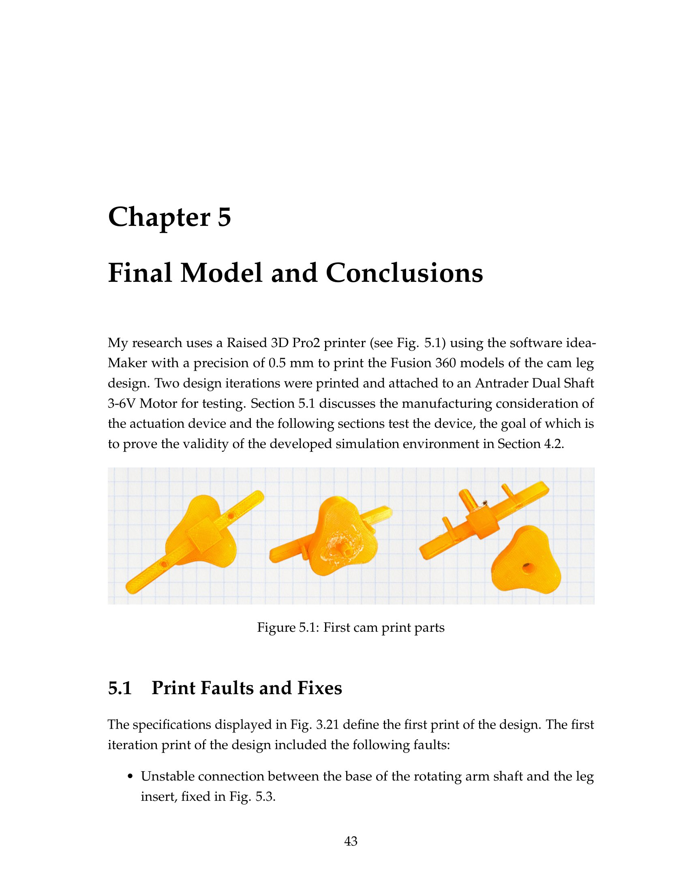
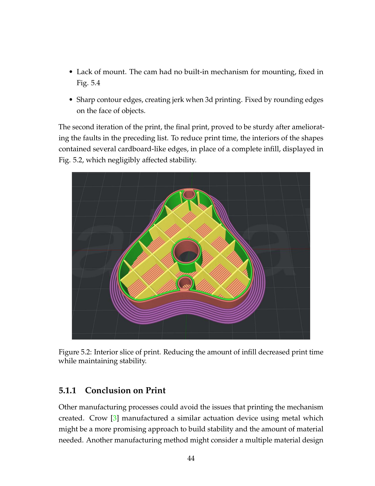
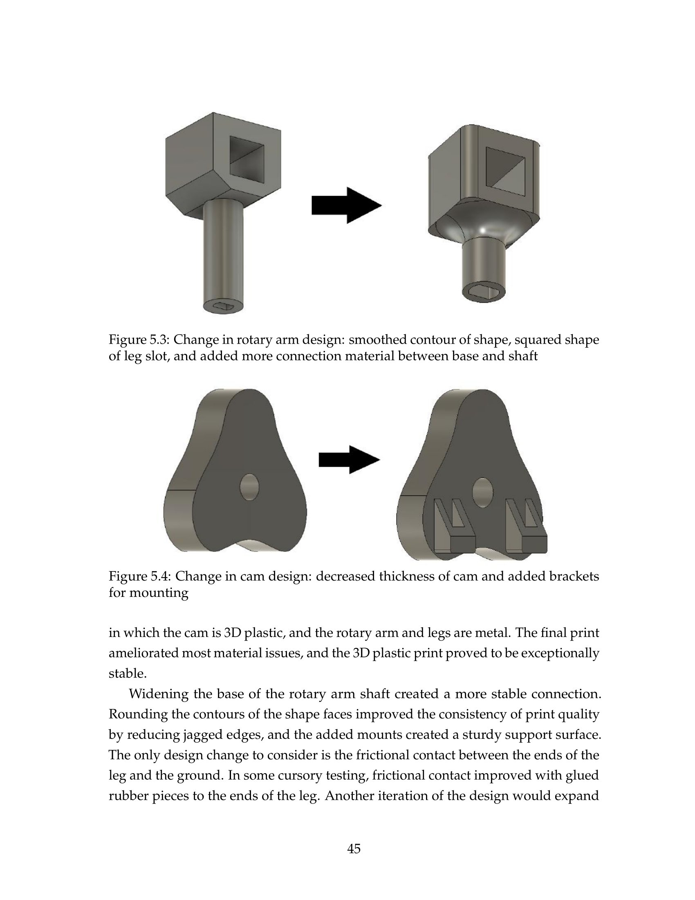
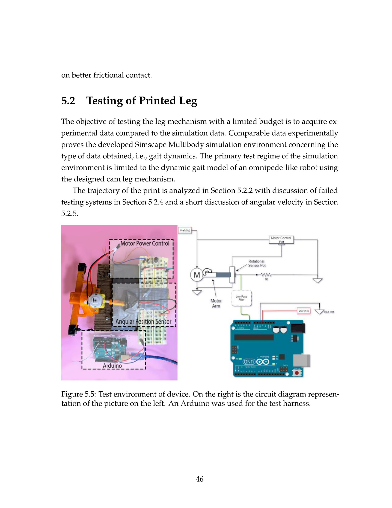
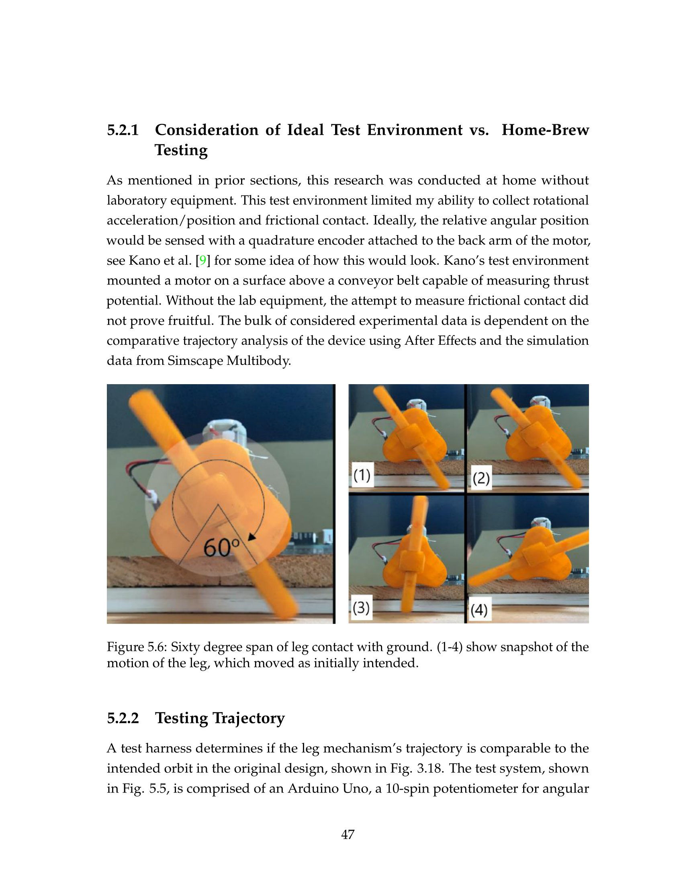
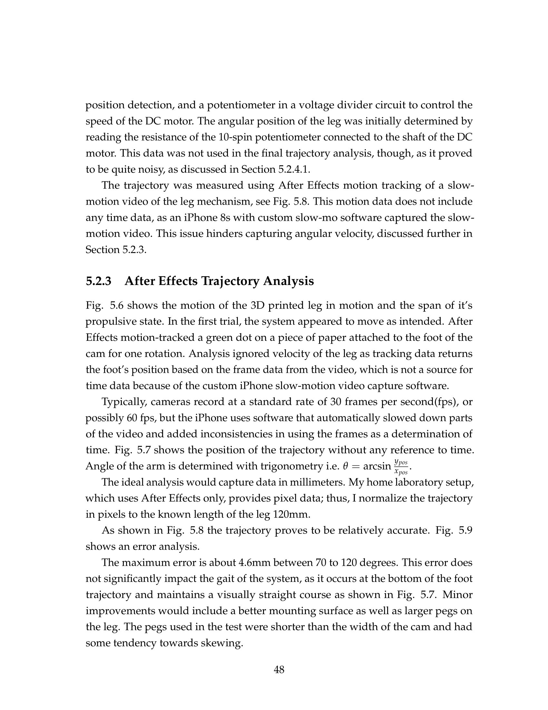

# Replicating Millipede Locomotion with Cheap/Cam Actuators
## Sample of thesis below. Click [here](https://github.com/KyleAlanJeffrey/Senior-Robotics-Thesis-Walker/blob/main/Jeffrey_Kyle_Robotics_Thesis.pdf) for full report.

